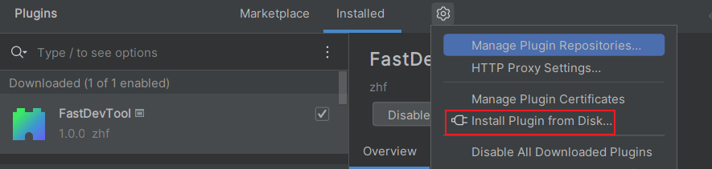
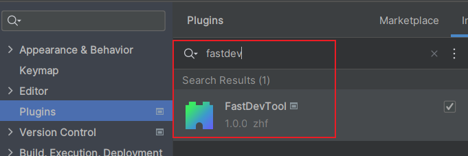
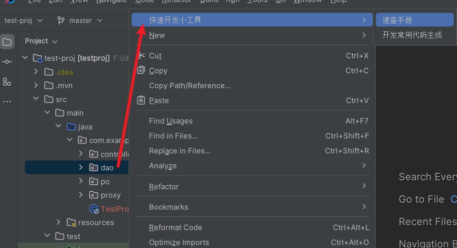
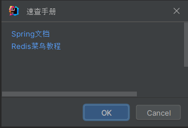
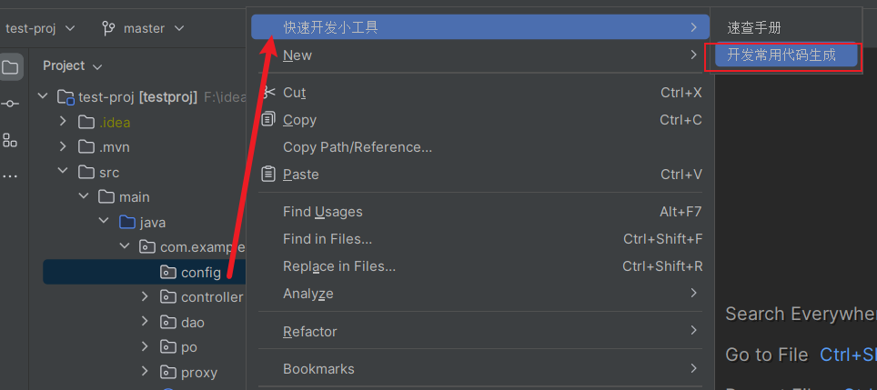
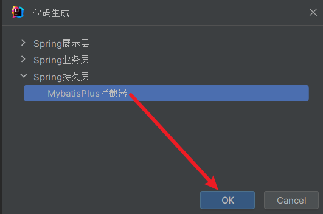

# 插件说明

## 1. 安装
### 1.1. 离线安装
下载插件zip包，使用IDEA离线安装方式安装。 

### 1.2. 在线安装
在IDEA插件市场搜索'FastDevTool'安装。 

## 2. 使用
鼠标右键项目弹出'快速开发工具'菜单，选择二级菜单使用对应功能，功能说明见下面第3点。 

## 3. 功能说明
- <b>速查手册(完善中)</b> 
提供开发常用的技术手册，点击超链接直接打开网页。 
  

- <b>代码生成(完善中)</b> 
目前仅支持Spring的一些代码模板生成。在需要生成代码的目录下右键选择"开发常用代码生成“，在弹出的窗口中选中分类后点击OK按钮会在当前目录生成代码。
  
  
  

- <b>更多功能完善中</b> 